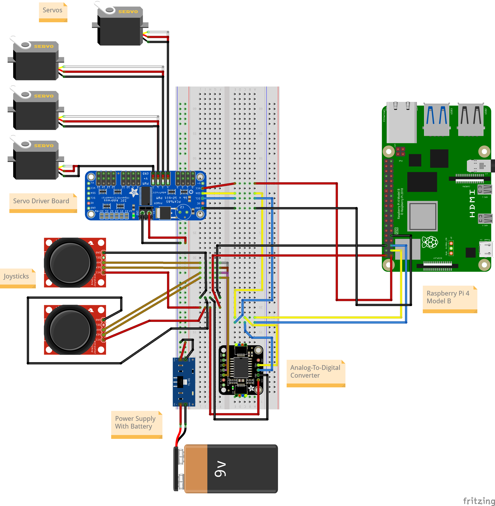

# Aaron's Three-Jointed Robotic Arm

| **Engineer** | **School** | **Area of Interest** | **Grade** |
|:--:|:--:|:--:|:--:|
| Aaron E | NorthStar Academy & CCU Academy | Mechanical Engineering/Robotics| Incoming Junior

# First Milestone

<iframe width="560" height="315" src="https://www.youtube.com/embed/yEpLYypxVuE?list=PLe-u_DjFx7eticgHvdNBMS-CTTohSGwUM" title="Aaron E First Milestone" frameborder="0" allow="accelerometer; autoplay; clipboard-write; encrypted-media; gyroscope; picture-in-picture; web-share" referrerpolicy="strict-origin-when-cross-origin" allowfullscreen></iframe>

My first milestone involved assembling and testing the Cokoino robotic arm using assembly guides and sample code provided by Cokoino. Before assembling the arm, I used sample code to test the servo motors and realign their angles to 90°.

As I worked through this process, I encountered my first issue. After I tested two of the four servos, my computer stopped recognizing the Arduino Nano that is used in this project. I fixed this issue by restarting my computer, which allowed my Windows operating system to correctly identify the Nano again.

After I finished testing and aligning the servos, I continued with the assembly of the structure of the arm. Due to the small size of some of the parts, the assembly was at times difficult, but I can now control my robotic arm using the attached joysticks.

The Arduino Nano runs a program provided by Cokoino that accepts the potentiometer input of two joysticks and converts the input to the proper angles for the servos to rotate to. I will modify my project so that I can control the arm using a Raspberry Pi 4 rather than the Arduino Nano. To accomplish this, I will write a custom Python program for interfacing with the servos and joysticks.

# Second Milestone

<iframe width="560" height="315" src="https://www.youtube.com/embed/uQCSEdtbfX0" title="Aaron E  Second Milestone" frameborder="0" allow="accelerometer; autoplay; clipboard-write; encrypted-media; gyroscope; picture-in-picture; web-share" referrerpolicy="strict-origin-when-cross-origin" allowfullscreen></iframe>
For my second milestone, I reconfigured the setup of my robotic arm to use a Raspberry Pi as the controller. I encountered some issues along the way, but I have made great progress toward being able to control the robotic arm using the Raspberry Pi. My general process for this milestone was as follows.

## Interfacing Between the Raspberry Pi & Servo Driver Board

My first step was to get the Raspberry Pi interfacing properly with the servo driver board. I first downloaded the necessary libraries (specifically the Adafruit CircuitPython ServoKit library), then I connected all of the proper wires and looked at an online tutorial to help me write a simple test program to try controlling the arm. This particular servo driver board uses the I2C communication protocol. This communication protocol allows the Pi to interface with multiple devices over just two wires.

Later, I realized that the servo driver board was not properly driving the servos because I had not yet configured the external power supply to supply a voltage. I was using this external power supply to supply power for driving the servos. I then ran my program to manually input different angles to move the servos, and the servos responded correctly.

## Setting Up The Joysticks & Analog-To-Digital Converter

My next step was to incorporate the joysticks into the system. This required setting up the analog-to-digital converter, or ADC. Since the Raspberry Pi cannot read the analog outputs of the joysticks itself, the Raspberry Pi needs a separate board to convert the analog output of the joysticks to a digital input for it. Both the ADC and servo driver board that I used communicate with the Pi using the I2C communication protocol.

The methods of using the ADC were not immediately intuitive for me, but I took my time, checked my wiring multiple times, did research, and asked questions. So, in the end, I succeeded. Before this point, however, I realized that there was an undefined variable in my code, but this was easily fixed by adding a line to my code that defined the analog input pin that I was using on the ADC to read the values from the joystick.

After I fixed this, I encountered another issue where the ADC kept outputting the same value over and over again. I solved this issue by reconfiguring the power and ground wires for the ADC and joysticks so that they were all on the same circuit. After I made this change, the test program worked properly, outputting different values as I moved the joystick.

## Putting It All Together

My final step was to integrate the servo driver board and ADC together. Once I completed the wiring for this, I wrote a test program that uses the input of one axis of one of the joysticks to control one of the servos in the arm. The analog output of the joystick goes to the ADC, which converts it to a digital input for the Raspberry Pi. My Python program then uses a piecewise function to convert the value provided by the ADC to an angle to send to the servo driver board, which in turn tells the servo the correct angle to rotate to.

The piecewise function conversion step was necessary to correctly translate the position of the joysticks to the position of the servos. The output range of the joysticks is from 0 to 255, while the movement of the servos is restricted to 0 to 180 degrees. This meant that some function was necessary to translate the input of the joystick to the proper angle for the servos. However, the physical middle position of the joystick outputs a value of about 211. This meant that the conversion from the input of the joystick to the output angle of the servo could not simply be a linear function, because two different conversions were necessary to account for the uneven range of values above and below the center of the joystick.

## Next Steps

My setup now works as expected, with the position of the joystick being correlated to an angle for the servo. Moving forward, I will first finish integrating the remaining axes of the joysticks. Then I will potentially alter my code to have the position of the joysticks determine the speed at which the servos rotate, rather than determining the exact angle of the servo. If I have time, I may also incorporate a pressure sensor to allow the gripper to automatically stop closing when it has sufficiently grasped an object.

<!--
# Final Milestone

**Don't forget to replace the text below with the embedding for your milestone video. Go to Youtube, click Share -> Embed, and copy and paste the code to replace what's below.**

<iframe width="560" height="315" src="https://www.youtube.com/embed/F7M7imOVGug" title="YouTube video player" frameborder="0" allow="accelerometer; autoplay; clipboard-write; encrypted-media; gyroscope; picture-in-picture; web-share" allowfullscreen></iframe>

For your final milestone, explain the outcome of your project. Key details to include are:
- What you've accomplished since your previous milestone
- What your biggest challenges and triumphs were at BSE
- A summary of key topics you learned about
- What you hope to learn in the future after everything you've learned at BSE
-->

# Schematics

# Code
[Here](https://github.com/Cokoino/CKK0006/blob/master/Lesson%204%20-%20Test%20The%20Joystick%20Module/code/joystick/joystick.ino) is the code used to test the joysticks.

[Here](https://github.com/Cokoino/CKK0006/blob/master/Lesson%205%20-%20Test%20The%20Servo/code/servo_code1/servo_code1.ino) is the code used to test the servos.

[Here](https://github.com/Cokoino/CKK0006/blob/master/Lesson%206%20-%20Assembly%20The%20Robot/Code/Servo_90_ADJ/Servo_90_ADJ.ino) is the code used to align the servos.

[Here](https://github.com/Cokoino/CKK0006/tree/master/Lesson%207%20-%20Control%20The%20Robot%20Arm/Code/Arm) is the code used to control the completed arm using the Arduino Nano. (Note: the src folder must be in the same directory as the main code for the main code to upload to the Arduino Nano correctly.)

[Here](https://github.com/AaronE-1/Aaron-2024-BSE-Portfolio/blob/gh-pages/ServoDriverBoardTestProgram.py) is the code used to test the servo driver board.

[Here](https://github.com/AaronE-1/Aaron-2024-BSE-Portfolio/blob/gh-pages/ADCTestProgram.py) is the code used to test the analog-to-digital converter.

[Here](https://github.com/AaronE-1/Aaron-2024-BSE-Portfolio/blob/gh-pages/ArmProgram1.py) is the first program I wrote to use both the servo driver board and the analog-to-digital converter.

# Bill of Materials

| **Part** | **Note** | **Price** | **Link** |
|:--:|:--:|:--:|:--:|
| Robot Arm Kit | Includes all parts for the structure of the arm, as well as the original electronics | $49.99 | <a href="[https://www.amazon.com/Arduino-A000066-ARDUINO-UNO-R3/dp/B008GRTSV6/](https://www.amazon.com/LK-COKOINO-Compliment-Engineering-Technology/dp/B081FG1JQ1)"> Link </a> |
| Servo Shield | Board used to connect the servos to the Arduino | $10.99 | <a href="https://www.amazon.com/HiLetgo-Expansion-Sensor-Arduino-Duemilanove/dp/B07VQRCC8F"> Link </a> |
| 9V Batteries | Provide power to system | $8.99 | <a href="https://www.amazon.com/PILOCEL-6LR61-Long-Lasting-Valentines-Leak-Proof/dp/B0BJ26CHZB?th=1"> Link </a> |
| 9V Battery Barrel Jack Connector | Connects 9V batteries to system | $5.99 | <a href="https://www.amazon.com/DZS-Elec-Connector-Experimental-5-5x2-1mm/dp/B07FDS11ZY?th=1"> Link </a> |
| Screwdriver Kit | Used for assembling parts | $7.99 | <a href="https://www.amazon.com/Small-Screwdriver-Set-Mini-Magnetic/dp/B08RYXKJW9/"> Link </a> |
| Electronics Kit | Spare electronics parts | $13.99 | <a href="https://www.amazon.com/Smraza-Electronics-Potentiometer-tie-Points-Breadboard/dp/B0B62RL725"> Link </a> |
| Digital Multimeter | Used to test various circuit parameters | $16.23 | <a href="https://www.amazon.com/AstroAI-Digital-Multimeter-Voltage-Tester/dp/B01ISAMUA6"> Link </a> |
| Raspberry Pi 4 Model B Starter Kit | Includes Raspberry Pi 4 Model B computer and necessary peripherals | $93.00 | <a href="https://www.amazon.com/Vemico-Raspberry-Starter-Heatsinks-Screwdriver/dp/B09QGZ94M8"> Link </a> |
| Servo Driver Board | Used to drive servo motors | $9.99 | <a href="https://www.amazon.com/gp/product/B0CNVBWX2M"> Link </a> |
| Analog-To-Digital Converter | Used to convert analog output signal of joysticks to digital input values for the Raspberry Pi | $9.99 | <a href="https://www.amazon.com/gp/product/B07YKH3T4C"> Link </a> |
| Portable Battery For Raspberry Pi | Used to power the Raspberry Pi without connection to wall outlet | $29.99 | <a href="https://www.amazon.com/gp/product/B0C7PHKKNK"> Link </a> |

# Other Resources/Examples
- [Original Assembly Guide & Code](https://github.com/Cokoino/CKK0006)
- [Tutorial for Using Servo Driver Board](https://learn.adafruit.com/adafruit-16-channel-servo-driver-with-raspberry-pi/overview)
- [Data Sheet for External Power Supply](https://mega.nz/folder/MxgnBIDB#ygd3AMdhvgNAntwzRcWvpg/file/l1xmzZAA)
- [Pin Diagram for Raspberry Pi](https://www.youngwonks.com/blog/Raspberry-Pi-4-Pinout)
- [Tutorial for Using Analog-To-Digital Converter](https://circuitdigest.com/microcontroller-projects/interfacing-pcf8591-adc-dac-module-with-raspberry-pi)
- [Tutorial for Installing adafruit_blinka Library on Raspberry Pi](https://learn.adafruit.com/circuitpython-on-raspberrypi-linux/overview)
- [Fritzing Part File for External 5V Power Supply](https://github.com/RafaGS/Fritzing/blob/master/DC-DC%20Power%20Module%20(5v)%20top.fzpz)
- [Fritzing Part File for Analog-To-Digital Converter](https://github.com/adafruit/Fritzing-Library/blob/master/parts/Adafruit%20PCF8591.fzpz)
- [Circuit Diagram Tool](https://fritzing.org/)
- [Proofreading Tool](https://www.grammarly.com/)
- [Screen Recording Tool](https://www.loom.com/)
- [Useful AI Chatbot for Help with Engineering Troubleshooting](https://chatgpt.com/)
